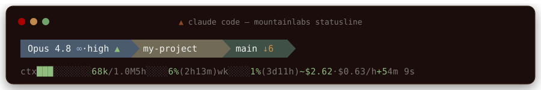
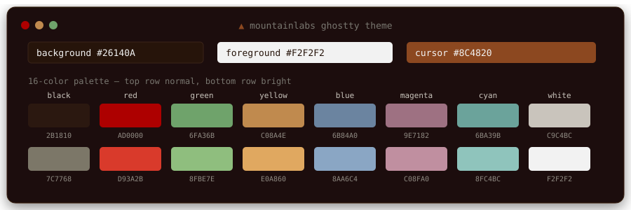

<div align="center">

# MountainLabs Statusline

**A two-line statusline for [Claude Code](https://claude.com/claude-code) — model, git, context, usage caps, and cost, above your prompt.**

[](https://github.com/ClearMountainDigital/mountainlabs-statusline/actions/workflows/ci.yml)
[](LICENSE)
[](statusline.sh)
[](#requirements)
[](https://claude.com/claude-code)



</div>

---

Claude Code streams live session state to your statusline command as JSON on every render. This script renders it — the numbers the app itself reports, read straight from that payload instead of scraped from log files. MountainLabs.ai palette; identity on top, telemetry below.

```
 Opus 4.8 ∞·high ▲    my-project    main ↓6
ctx ███░░░░░░░ 68k/1.0M   5h █░░░ 6% (2h13m)   wk █░░░ 1% (3d11h)   ~$2.62 ·$0.63/h   agt 3·~$1.94 (46%)   +5   4m 9s
```

---

## Features

**Line 1 — identity** (powerline segments)
- **Model + effort** — `high ▲`, `xhigh ▲▲`, `max ◆◆◆`; a `∞` marks a 1M-context model.
- **Folder** — the current working directory.
- **Git** — branch (or short SHA when detached), a **worktree marker** detected from git, and `↑ahead ↓behind +staged ✎modified …untracked`. A clean repo shows a single `✓`.

**Line 2 — telemetry** (green → rust → red ramp)
- **Context** — a bar scaled to the full context window plus `used / total` tokens. The color is a **gradient keyed on absolute tokens, not % of window**: pure green through the ~100k "smart zone," then each cell warms green → rust → red as it reaches into the "dumb zone," hitting full red by 400k. On a 1M window this is the point — 600k tokens is only 60% (looks fine on a percentage bar) but is deep in degraded territory, and the gradient shows it.
- **Usage caps** — rolling **5-hour** and **weekly** limits, each with a reset countdown in parentheses (Pro/Max plans; hidden on pay-as-you-go API billing).
- **Cost** — the model-aware session estimate, colored by size, with a `·$/h` burn rate.
- **Agent spend** — cost of Task/Agent **subagents** this session (`agt 3·~$1.94 (46%)`): subagent count, their summed cost, and the share of total spend they account for. Subagents run in their own context window, so this money never shows up in the context gauge — this segment is what explains a climbing bill next to a flat `ctx`. Appears only when the session has spawned subagents.
- **Churn** — lines added / removed this session.
- **Timer** — session wall-clock.

> [!NOTE]
> Almost everything is read straight from the stdin payload — no background daemon, no log parsing. The one exception is **agent spend**, which sums the session's subagent transcripts (Claude Code doesn't report subagent cost on stdin); that read is signature-gated and cached so it only re-parses when a subagent transcript actually changes.

---

## Install

**One-liner** — downloads the script, wires up `settings.json`, backs up anything it replaces:

```sh
curl -fsSL https://raw.githubusercontent.com/ClearMountainDigital/mountainlabs-statusline/main/install.sh | bash
```

**From a clone:**

```sh
git clone https://github.com/ClearMountainDigital/mountainlabs-statusline.git
cd mountainlabs-statusline
./install.sh
```

**Manual:**

1. Copy `statusline.sh` to `~/.claude/statusline.sh` and `chmod +x` it.
2. Add the `statusLine` block from [`examples/settings.json`](examples/settings.json) to `~/.claude/settings.json`.
3. Restart Claude Code.

Set your terminal font to a [Nerd Font](https://www.nerdfonts.com/) so the glyphs render (see [Requirements](#requirements)).

---

## Requirements

| Need | Why | Install (macOS) |
|---|---|---|
| `bash`, `git`, `awk`, `date` | Rendering + git state | Preinstalled |
| `jq` | Parse the status JSON | `brew install jq` |
| A **Nerd Font** | The branch, folder, worktree, and powerline glyphs | `brew install --cask font-jetbrains-mono-nerd-font` |

Runs on **macOS** and **Linux**, in any terminal. Set the terminal font to the installed Nerd Font (e.g. `JetBrainsMono Nerd Font`).

---

## Anatomy

**Line 1 — identity**

| Piece | Example | Notes |
|---|---|---|
| Model + effort | `Opus 4.8 ∞·high ▲` | `∞` = 1M-context model. Effort: `high ▲` · `xhigh ▲▲` · `max ◆◆◆`; `low`/`medium` show nothing. |
| Folder | `my-project` | Current directory name. |
| Branch | `main` | Short SHA when in detached HEAD. |
| Worktree | `my-project` | Fork glyph + parent repo — shown only inside a linked git worktree. |
| Git status | `↑2 ↓6 +1 ✎3 …4` / `✓` | ahead · behind · staged · modified · untracked. Each part appears only when non-zero; all-clean shows `✓`. |

**Line 2 — telemetry**

| Piece | Example | Notes |
|---|---|---|
| Context | `ctx ███░░░░░░░ 68k/1.0M` | Bar scaled to the full window; colored by an **absolute-token gradient** (green ≤100k, ramping to red by 400k), so it flags the "dumb zone" even when % of window is low. Shows `ctx —` until the CLI reports usage. |
| 5h / weekly caps | `5h ░░░░ 6% (2h13m)` | Usage against your rolling caps + time to reset. Pro/Max only. |
| Cost | `~$2.62 ·$0.63/h` | Model-aware estimate (`~` = estimate) + burn rate. |
| Agent spend | `agt 3·~$1.94 (46%)` | Subagent count · their summed cost · % of session spend. Priced per each subagent's own model. Hidden until the session spawns a subagent. |
| Churn | `+5 −0` → `+5` | Lines added / removed; zero sides are hidden. |
| Timer | `4m 9s` | Session wall-clock. |

---

## Palette — MountainLabs.ai

Identity segments use brand hues. Every gauge shares one ramp: **sage → rust → red = safe → warning → danger.** Accent foregrounds are tuned for contrast — they must stay legible both on the mid-tone line-1 segment backgrounds (WCAG 1.4.11 UI ≥ 3.0) and on a dark terminal (AA ≥ 4.5), so they run brighter than the raw brand swatches.

| Role | Hex | | Role | Hex |
|---|---|---|---|---|
| Foreground | `#F2F2F2` | | Gauge · safe | `#96C8A5` sage |
| Model segment · slate | `#495B6C` | | Gauge · warning | `#E28A4A` rust |
| Folder segment · stone | `#716A56` | | Gauge · danger | `#EE6C64` red |
| Git segment · forest | `#3F5147` | | Accent · ahead | `#96B4CD` sky |
| Base / background | `#26140A` | | Accent · behind | `#D0AA68` amber |

---

## Customizing

Everything is at the top of [`statusline.sh`](statusline.sh), commented.

**Thresholds** — the color flip points:

```sh
CTX_WARN_PCT=70    # caps: sage -> rust at this % of the cap
CTX_DANGER_PCT=90  # caps: rust -> red  at this %
CTX_GOOD_TOK=100000  # context: pure green up to here (end of the "smart zone")
CTX_RED_TOK=400000   # context: full red by here, then clamped (the "dumb zone")
COST_WARN=5        # session cost:   sage -> rust at this many dollars
COST_DANGER=20     # ...             rust -> red  at this many dollars
```

The 5h/weekly cap bars use the two `_PCT` zone thresholds (a flat three-color flip). The **context** bar is a smooth per-cell gradient driven by the two `_TOK` values — raise `CTX_GOOD_TOK` if your model holds quality further, or lower `CTX_RED_TOK` to warn harder, sooner.

**Palette** — the `# palette` block holds every color as an `R;G;B` triple. The ramp is `SAGE → RUST → RED`.

**Effort flair** — edit the `case "$EFFORT"` block to change glyphs or colors per reasoning level.

> [!TIP]
> The documented payload doesn't expose a fast-mode field, so the `⚡` flag stays hidden until it appears. To show **thinking on/off** instead, read `.thinking.enabled` near the `FAST=` line and append a glyph to `model_txt` the way the effort flair does.

---

## Settings precedence

Claude Code merges settings in this order, later wins:

```
~/.claude/settings.json   →   <project>/.claude/settings.json   →   <project>/.claude/settings.local.json
```

A **project** `.claude/settings.json` with its own `statusLine` (e.g. `ccusage`) overrides your user-level bar in that repo. To win locally without editing the shared file, set `statusLine` in that project's `.claude/settings.local.json` (git-ignored, highest priority).

---

## Troubleshooting

| Symptom | Fix |
|---|---|
| Boxes / `?` where icons should be | Terminal font isn't a Nerd Font. Install one and set it as the terminal font. |
| 5h / weekly gauges missing | Expected on pay-as-you-go API billing — those fields come with Pro/Max plans. |
| Cost looks off | Update the Claude Code CLI; the estimate tracks the pricing the installed version knows. |
| `agt` segment missing | Expected until the session spawns a Task/Agent subagent. Older CLIs that inline subagent turns (no `subagents/` dir) won't populate it. |
| `agt` cost looks off | Its per-model rates are a local estimate — sync the `agent_spend` pricing block with [claude.com/pricing](https://claude.com/pricing). |
| Bar is blank or errors | Run it by hand: `echo '{}' \| ~/.claude/statusline.sh` (needs `jq`). |
| A project shows a different bar | Settings precedence — see above. |

---

## Uninstall

```sh
# restore the settings.json the installer backed up
cp ~/.claude/settings.json.bak-statusline ~/.claude/settings.json

# remove the script
rm ~/.claude/statusline.sh
```

---

## Bonus — MountainLabs Ghostty theme

Optional, not required — the statusline works in any terminal. [`examples/ghostty.config`](examples/ghostty.config) is a matching theme for [Ghostty](https://ghostty.org): the 16 ANSI colors remapped to the MountainLabs palette on a `#26140A` background, plus padding, line spacing, and a steady rust cursor. Green stays green and red stays red so diffs and errors read correctly.



Copy it to `~/.config/ghostty/config` and reload with `Cmd+Shift+,`.

---

## How it works

Claude Code invokes your `statusLine.command` on every render and pipes it a JSON object of session state on **stdin**. This script reads it with `jq`, formats two lines of ANSI-colored text, and prints them. Fields used: `model`, `workspace.current_dir`, `context_window.*`, `cost.*`, `rate_limits.*`, plus `transcript_path` and `session_id` for agent spend. Git state comes from `git` run against the workspace directory, which is what makes branch and worktree detection accurate regardless of the payload.

**Agent spend** is the one piece not on stdin. Each Task/Agent subagent runs in its own context window and gets its own transcript at `<transcript_path minus .jsonl>/subagents/agent-*.jsonl`. Every assistant line there carries a `message.usage` block (`input_tokens`, `output_tokens`, `cache_creation_input_tokens`, `cache_read_input_tokens`) and its own `message.model` — subagents frequently run a cheaper model than the main thread, so each line is priced by its own model. The parse is gated by a cheap `count-mtime-size` signature written to `${XDG_CACHE_HOME:-~/.cache}/mountainlabs-statusline/`, so a busy session re-parses only when a subagent transcript actually changes; steady state is one `stat()` per file. Pricing multipliers live in the `agent_spend` function — update them from [claude.com/pricing](https://claude.com/pricing) when rates change.

See the [statusline docs](https://code.claude.com/docs/en/statusline) for the full schema.

---

<div align="center">

**[MountainLabs.ai](https://mountainlabs.ai)** · [MIT](LICENSE)

</div>
